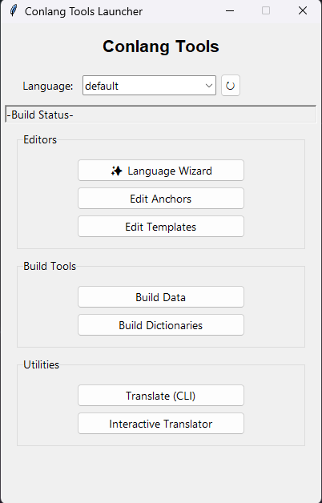
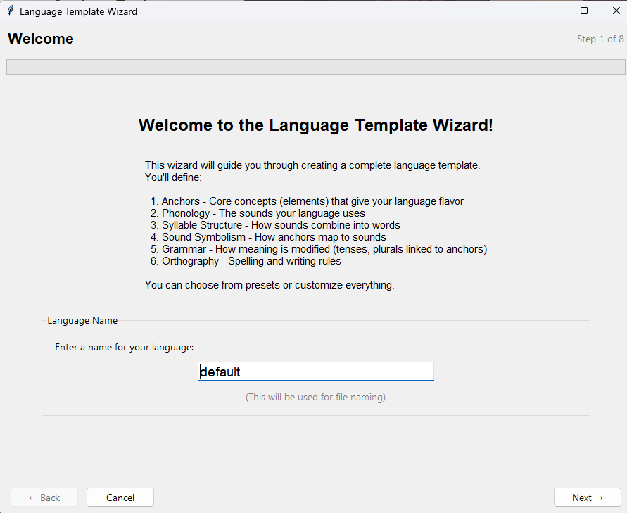
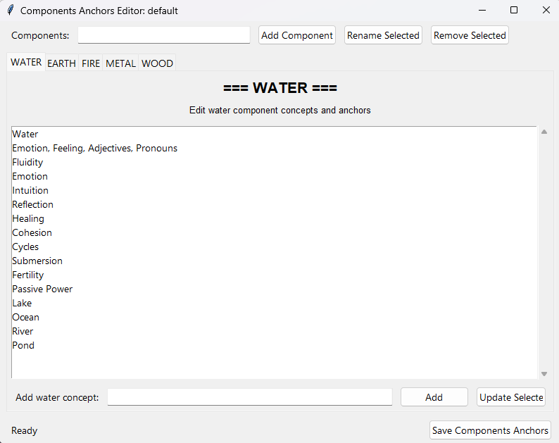
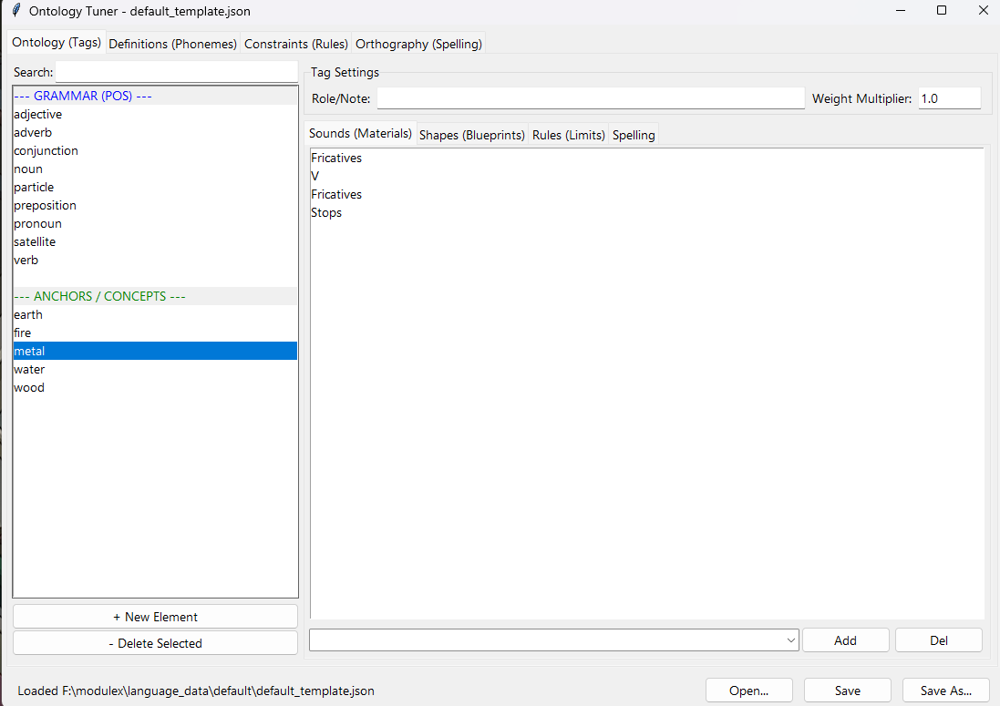
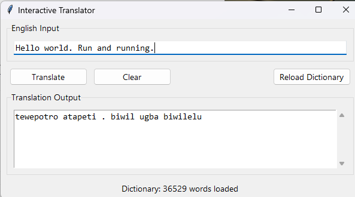
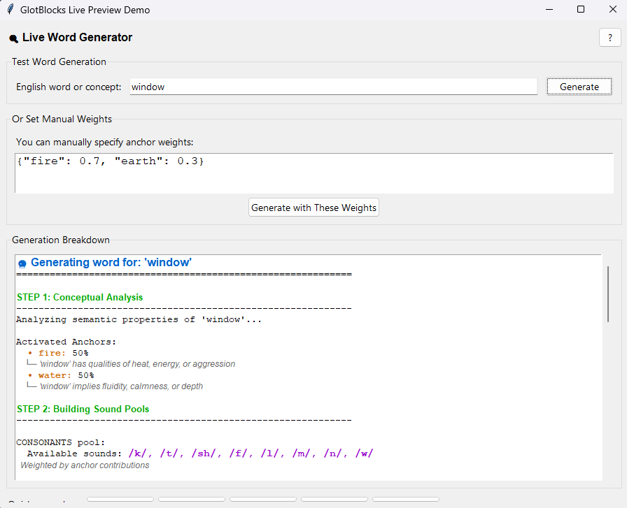

# Conlang Tools - Ontological Word Generator

A comprehensive toolkit for creating constructed languages using an "ontological blender" approach. Words are generated based on conceptual anchors (like elements: fire, water, earth) that influence sound selection, creating meaningful sound symbolism.



## Features

- **Language Wizard** - Step-by-step guide to create new languages
- **Anchors Editor** - Define conceptual categories (elements) for your language
- **Templates Editor** - Configure phonology, syllable structures, morphology, and orthography
- **Interactive Translator** - Translate English text to your conlang
- **Build Tools** - Generate dictionaries from WordNet data

## Screenshots

### Language Wizard
Create a new language with guided steps for anchors, phonology, syllables, sound symbolism, grammar, and orthography.



### Anchors Editor
Define the conceptual anchors (elements) that give your language its unique flavor.



### Templates Editor
Configure phonemes, syllable patterns, morphology suffixes, and spelling rules.



### Interactive Translator
Translate English sentences into your constructed language.



### Live Word Generator
See exactly how words are built step-by-step, with anchor weights, sound pools, and constraint checking.



## Installation

1. Ensure Python 3.8+ is installed with tkinter
2. Install dependencies:

```bash
pip install -r requirements.txt
```

3. Download the spaCy English model:

```bash
python -m spacy download en_core_web_lg
```

4. Download NLTK WordNet data:

```python
python -m nltk.downloader wordnet
python -m nltk.downloader omw-1.4
```

## Quick Start

1. Run the launcher:

```bash
python main.py
```

2. Use the **Language Wizard** to create a new language, or select an existing one from the dropdown
3. Edit **Anchors** and **Templates** to customize your language
4. **Build Data** then **Build Dictionaries** to generate the lexicon
5. Use the **Interactive Translator** to translate text

## File Structure

```
modulex/
├── main.py                      # Main launcher GUI
├── conlang_template_wizard.py   # Step-by-step language creation wizard
├── conlang_edit_anchors.py      # Anchors/concepts editor
├── conlang_edit_templates.py    # Template editor (phonology, morphology, etc.)
├── conlang_engine.py            # Core word generation engine
├── conlang_build_data.py        # Build elemental data from WordNet
├── conlang_build_dictionaries.py # Generate full dictionary
├── conlang_translate.py         # Translation engine
├── conlang_language_paths.py    # File path utilities
├── documentation/
│   ├── conlang_live_preview.py  # Live word generator demo
│   ├── glotblocks_process_flow.html  # Visual process flow diagram
│   └── INTEGRATION_GUIDE.md     # Developer integration guide
└── language_data/
    ├── default/                 # Default language files
    │   ├── default_template.json
    │   └── default_anchors.json
    └── {language}/              # Per-language directories
        ├── {language}_template.json
        ├── {language}_anchors.json
        └── {language}_dictionary.json
```

## How It Works

1. **Anchors** define conceptual categories (fire, water, earth, metal, wood) with associated meanings
2. **Templates** map anchors to sound categories, creating sound symbolism
3. **Morphology** defines grammar suffixes linked to anchors
4. **The Engine** blends sounds based on a word's conceptual tags to generate phonetically meaningful words

## Notes

- Constraints are treated as forbidden regexes: if a word matches an enabled pattern, it is rejected
- Sound pools are weighted by concept `weight`
- Definitions referenced in `add_sounds` are expanded into their respective slot pools
- Orthography rules are applied after a word passes constraints
